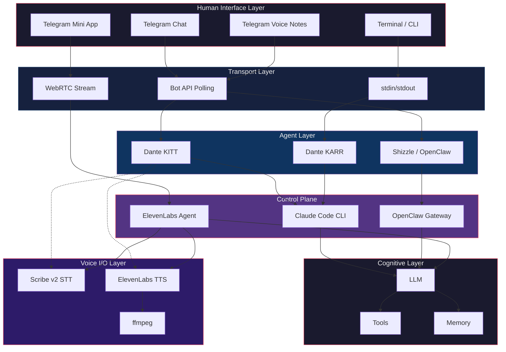
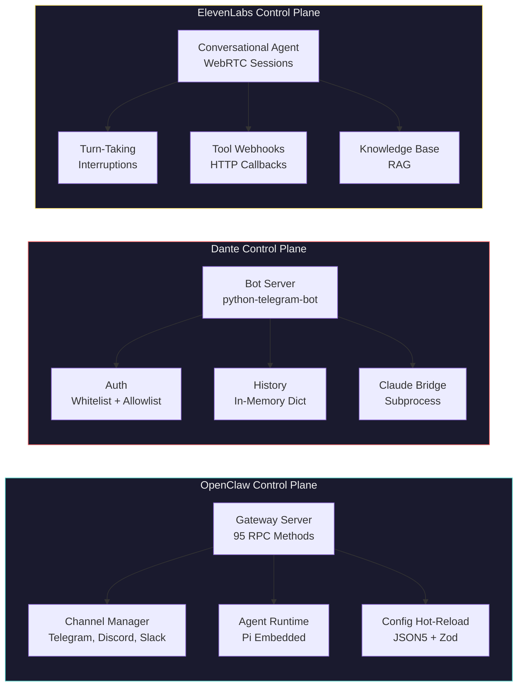
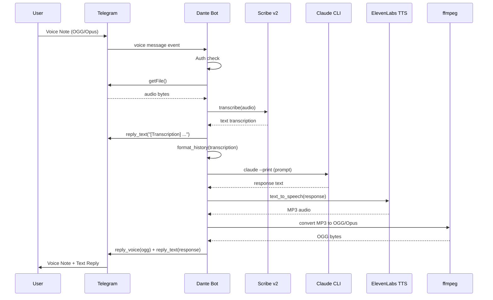
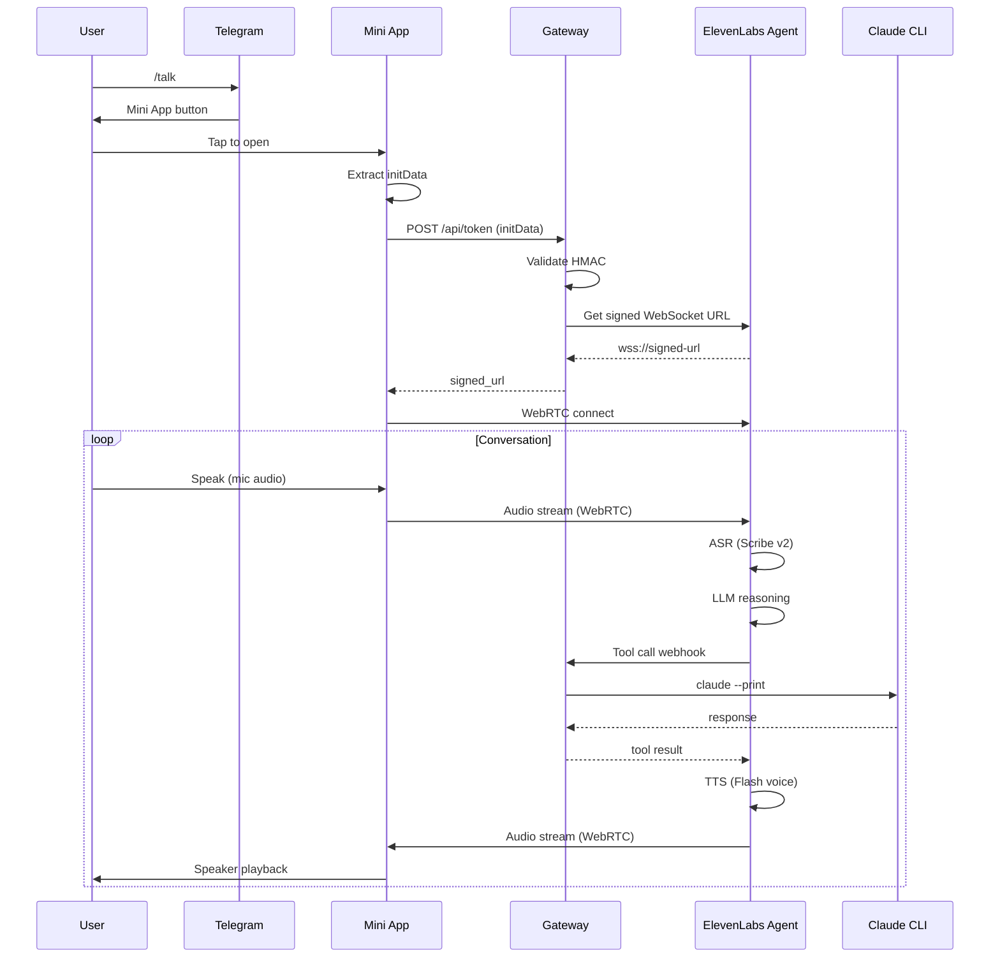

# Layers & Control Planes

> A visual guide to the agent ecosystem architecture — how Telegram, Dante, OpenClaw,
> ElevenLabs, and Claude Code stack together as layers with distinct control planes.

---

## 1. The Six Layers

Every message — text or voice — flows through six layers from human to cognition and back.



### Layer Descriptions

| Layer | What Lives Here | Key Property |
|-------|----------------|--------------|
| **Human Interface** | Telegram (chat, voice, Mini App), terminal | Where humans interact |
| **Transport** | Bot API polling, WebRTC, stdin/stdout | Wire protocol between human and agent |
| **Agent** | Dante KITT, Shizzle, Dante KARR | Identity, auth, conversation memory |
| **Control Plane** | OpenClaw Gateway, Claude CLI, ElevenLabs Agent | Orchestration, routing, session management |
| **Cognitive** | LLMs, tools (bash, read, write), memory (SQLite, Supabase) | Reasoning, action, persistence |
| **Voice I/O** | Scribe v2 (STT), ElevenLabs TTS, ffmpeg | Modality conversion — audio ↔ text |

The Voice I/O layer is **cross-cutting** — it wraps the Agent layer, converting audio to text on the way in and text to audio on the way out. It doesn't replace any layer; it extends the modalities available.

---

## 2. Three Control Planes

Each major system has its own control plane with distinct responsibilities, protocols, and state management.



### OpenClaw Control Plane (Shizzle)

The most sophisticated of the three — a full gateway server with 95 RPC methods over WebSocket.

| Aspect | Detail |
|--------|--------|
| **Protocol** | WebSocket RPC at `ws://127.0.0.1:18789` |
| **State** | Persistent sessions, SQLite memory, config hot-reload |
| **Channels** | Telegram (grammy), Discord, Slack, WhatsApp, web |
| **Voice** | 9 RPC methods (`talk.mode`, `tts.*`, `voicewake.*`) |
| **TTS Providers** | ElevenLabs, OpenAI, Microsoft Edge (3 built-in) |
| **Auth** | Token/password, DM pairing, group allowlists |
| **Routing** | Binding-based: channel → account → peer → agent |
| **Plugins** | `OpenClawPluginApi` with 14 hook events |

### Dante Control Plane (KITT)

Intentionally minimal — a 182-line Python script that does one thing well.

| Aspect | Detail |
|--------|--------|
| **Protocol** | Telegram Bot API (long polling) |
| **State** | In-memory dict (last 20 messages per chat, lost on restart) |
| **Bridge** | `claude --print` subprocess (stateless per call) |
| **Auth** | Hardcoded user ID whitelist + group allowlist |
| **Voice** | Adding: Scribe v2 STT + ElevenLabs TTS (Phase 1) |
| **Advantage** | Simple, fast to modify, no gateway dependency |

### ElevenLabs Control Plane (Phase 2: /talk)

A managed real-time voice conversation engine.

| Aspect | Detail |
|--------|--------|
| **Protocol** | WebRTC (Opus @ 48kHz, ~75ms latency with Flash voices) |
| **State** | Managed by ElevenLabs cloud (session-scoped) |
| **ASR** | Scribe v2 with partial results for barge-in |
| **TTS** | Flash voices, streaming, geographic routing |
| **Turn-taking** | Configurable eagerness (0.3 = 300ms wait) |
| **Tools** | Server tool webhooks → our Gateway → Claude |
| **Auth** | Telegram initData HMAC → Gateway mints WebRTC token |

---

## 3. Voice Note Flow (Phase 1)

The async voice path — user sends a voice note in Telegram, gets back a voice note + text.



**Key properties:**
- No new services needed — all calls are outbound from Dante
- OGG/Opus in, OGG/Opus out — ffmpeg only needed for TTS output conversion
- Scribe v2 accepts OGG directly (no input conversion)
- Latency: 5-10 seconds (download + STT + Claude + TTS + convert + upload)
- `record_voice` chat action shown during processing

---

## 4. Real-Time Voice Flow (Phase 2)

The `/talk` path — live conversation through a Telegram Mini App with WebRTC streaming.



**Key properties:**
- Three new services: Gateway (FastAPI), Mini App (React), HTTPS tunnel
- Sub-100ms voice latency (ElevenLabs handles the ASR→LLM→TTS loop)
- Turn-taking with interruption support
- Tool calls bridge back to Claude via Gateway webhook
- Auth chain: Telegram initData HMAC → Gateway → scoped WebRTC token

---

## 5. Cross-Cutting Concerns

### Authentication Chain

```
Human Interface          Agent Layer              Control Plane
─────────────          ───────────              ─────────────
Telegram user ID   →   Whitelist check      →   Claude CLI (local, trusted)
Telegram initData  →   HMAC validation      →   ElevenLabs token (scoped)
OpenClaw pairing   →   DM policy + allowlist →   Gateway auth (token/password)
```

### Memory & State

| Agent | Memory Type | Persistence | Scope |
|-------|------------|-------------|-------|
| **Dante KITT** | In-memory dict | Per-process (lost on restart) | 20 messages per chat |
| **Dante KARR** | Claude Code context | Per-session | Full conversation |
| **Shizzle** | SQLite + vector search | Persistent on disk | Per-agent, searchable |
| **ElevenLabs** | Session-scoped | Per-conversation | Cloud-managed |

### Telegram Constraints (Applies to All)

- **Bots can't hear other bots** — agent coordination must go through shared storage, not Telegram
- **4000 char message limit** — responses must be chunked
- **Voice notes are OGG/Opus** — ffmpeg needed for format conversion
- **Mini Apps require HTTPS** — ngrok or Cloudflare tunnel for local dev
- **Privacy mode** — must be disabled + bot re-added for group visibility

---

## 6. Where Voice Fits

Voice is not a new layer — it's a **modality adapter** that wraps existing layers:

```
Without voice:       Text → Agent → LLM → Agent → Text
With voice (async):  Audio → [STT] → Agent → LLM → Agent → [TTS + ffmpeg] → Audio
With voice (live):   Audio → [ElevenLabs Agent handles full loop] → Audio
```

The cognitive layer never sees audio. It's always text by the time it reaches the LLM. Voice is purely an I/O concern at the edges.

This is why adding voice to Dante is additive — existing text functionality is untouched. Voice notes go through the same `ask_claude()` and `format_history()` as text messages. The only new code is the modality conversion (STT/TTS) and the transport (WebRTC for /talk).

---

## Related Documents

- [Voice Architecture Blueprint](voice/voice.md) — ElevenLabs Agent + Mini App design
- [Dante Voice Research](voice/dante-voice-research.md) — OpenClaw voice infrastructure findings
- [Dante Voice Plan](voice/dante-voice-plan.md) — Implementation plan (Phase 1 + 2)
- [Telegram Bot Constraints](Telegram-Bots.md) — Bot API rules, privacy mode, bot-to-bot blindness
- [Gateway Architecture](../exploration/architecture/02-gateway.md) — OpenClaw RPC methods including voice
- [Channel Routing](../exploration/architecture/04-channels-routing.md) — Channel plugin architecture
