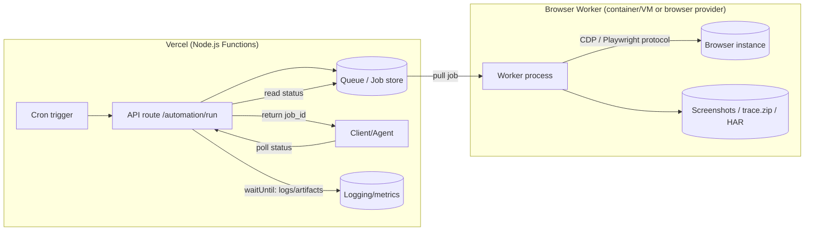

# Effective Browser Automation in a Real-World Agent Workflow

## Executive summary

The only enabled connector in your environment is entity["company","Vercel","cloud hosting platform"]. Vercel-hosted automation has hard ceilings (bundle size, memory, and max execution duration) that frequently push “real browser-in-function” designs toward either (a) remote browsers or (b) external worker services, with Vercel acting as an orchestrator. citeturn17search3turn17search6turn0search5turn17search7

In your **specific** context—agents repeatedly needing a logged-in browser for **Telegram Web**, a dashboard UI, and interactive OAuth flows—the highest-leverage change is to stop thinking in terms of “each script launches its own browser” and instead adopt a **long-lived, shared browser process** that humans can watch and agents can attach to. Playwright explicitly supports attaching to an existing Chromium-based browser over CDP (`connectOverCDP`), but notes that CDP connections are lower fidelity than Playwright’s native protocol and are only supported for Chromium-based browsers. citeturn2search1turn18search0

A practical **single-solution** strategy is: **standardize on Playwright APIs** for automation logic, but allow **multiple execution backends**:
- **Local/interactive backend:** one visible Chromium/Chrome process with a persistent profile, started once and kept alive; agents attach via CDP for “co-browsing”.
- **CI backend:** Playwright in containers (official Docker image and/or `install --with-deps`) for reproducible execution.
- **Vercel backend:** Vercel functions (Node runtime) orchestrate jobs and store results; browser execution happens in a **remote browser provider** or a dedicated container/VM worker. citeturn21search0turn17search2turn0search1turn9search0

This architecture directly targets the failure modes you reported: headful browsers dying when the launcher process exits, persistent profile locking, repeated re-login work, SPA rendering delays, and UI areas that don’t scroll like `window`. fileciteturn0file0

## User context and key assumptions

### What your agents are doing today

Your uploaded notes describe an agent workflow that depends on a **reliably logged-in browser** for:
- Telegram Web messaging workflows (read/send/observe, IDs).
- A control dashboard UI (“OpenClaw Dashboard”).
- OAuth flows for authorizing services (e.g., Notion) that require browser interaction.
- General logged-in web tasks. fileciteturn0file0

The notes also capture constraints that are common in agent automation but often under-planned:
- **Session persistence matters more than raw automation speed**.
- You sometimes need **headful** mode so the human and agent can reference the same UI state. fileciteturn0file0

### High-impact assumptions I have to make (and why they matter)

Some design choices hinge on details you didn’t specify; I’ll call them out so you can validate them against your environment:

1. **You can run a long-lived local process** (daemon/service) on your workstation or a small always-on VM. This enables the “shared browser” pattern that best fits your co-browsing requirement. (If not possible, you’ll want a remote browser service with a VNC/streamed UI instead.)
2. **At least some automation must run on Vercel** (or be triggered by Vercel routes/cron). Vercel Functions have strict limits and an ephemeral execution model, so heavy browsers often belong elsewhere. citeturn17search3turn17search6
3. **Most target sites are JS-heavy SPAs** (Telegram Web and dashboards typically are). This implies the success criterion is robust waiting strategies and stable locators, not fast page loads. fileciteturn0file0

## Automation landscape and tool inventory

### Protocols: what actually talks to the browser

Browser automation tools differ as much by **protocol** as by API shape:

- **WebDriver (HTTP)**: a entity["organization","World Wide Web Consortium","web standards org"] standard that defines remote control of user agents. citeturn1search11turn1search3  
- **WebDriver BiDi**: a newer W3C working draft adding bidirectional event streaming (better fit for evented browser behavior). citeturn5search4  
- **Chrome DevTools Protocol (CDP)**: a Chromium-focused, non-standard protocol. Selenium states CDP is **not designed for testing** and its API stability is version-dependent; Selenium treats CDP support as transitional while BiDi matures. citeturn2search0turn2search5  
- **Playwright protocol**: Playwright’s higher-fidelity connection mode using its own browser server. Playwright documents `launchServer()` + `connect()` and warns that **major/minor versions must match** between the connecting client and the launching server. citeturn18search0

In your situation, **CDP** is the key enabler for attaching to an already-open, human-visible Chromium instance; Playwright explicitly supports this via `connectOverCDP`, with the stated fidelity trade-off. citeturn2search1turn18search7

### Inventory table: tools, maturity, bindings, and trade-offs

The table below focuses on tools you explicitly asked to cover, plus the provider ecosystem you’ll likely need for Vercel/serverless realities.

| Category | Tooling / service | Primary protocol(s) | Language bindings & ecosystem | Strengths | Weaknesses / caveats | Maturity signals |
|---|---|---|---|---|---|---|
| Full-stack modern automation | Playwright | Playwright protocol; CDP attach via `connectOverCDP` (Chromium only) | Official multi-language: JS/TS, Python, Java, .NET. citeturn4search0 | Auto-waiting + actionability checks reduce flakiness; strong locator model; first-party tracing & reports. citeturn20search0turn20search2turn7search1 | Persistent profile dirs cannot be used concurrently; CDP attach is lower fidelity; warned about automating default Chrome user profile due to Chrome policy changes. citeturn1search0turn2search1 | Active docs & releases; official Docker images; guidance to pin versions. citeturn21search0 |
| Chromium-first automation | Puppeteer | CDP; optional WebDriver BiDi | Primarily JS/TS; `puppeteer.connect()` to existing browsers; explicit wsEndpoint lifecycle. citeturn3search7turn3search0turn3search1 | Extremely direct for Chromium/CDP workflows; “connect to existing browser” is first-class; can disconnect without closing browser. citeturn3search8turn3search9 | Cross-browser is improving but still more constrained than Playwright; heavy reliance on Chromium/CDP semantics. citeturn3search7turn2search5 | Current API docs show active versioning. citeturn3search1turn3search2 |
| Standards-based automation | Selenium (WebDriver) | WebDriver; transition toward BiDi; temporary CDP access | Broad official bindings across major languages; huge ecosystem; Grid for scaling. citeturn6search6turn5search0 | Standardization, vendor clouds, enterprise tooling, distributed execution with Grid. citeturn5search0turn5search1 | Selenium explicitly notes CDP isn’t stable and is transitional; WebDriver classic is request/response and can be awkward for real-time events until BiDi matures. citeturn2search0turn5search4 | “Latest releases” and recent stable versions listed. citeturn6search6turn6search3 |
| Drivers / headless engines | ChromeDriver | WebDriver + BiDi; Chromium-specific extensions | Used via Selenium & WebDriver clients | Driver maintained for Chrome/Chromium automation; official security guidance. citeturn11search1turn16search0 | Must be protected from remote access; version matching is a recurring operational issue; relies on Chrome-for-Testing distribution model for newer versions. citeturn16search0turn11search1turn11search2 | Official doc updates & MtM distribution notes (M115+). citeturn11search1turn11search2 |
| Drivers / Firefox | geckodriver | WebDriver; translates to Mozilla protocols | Used via Selenium/WebDriver clients | Firefox automation via W3C WebDriver; official Mozilla docs exist. citeturn12search5turn12search10 | Operationally different from Chromium/CDP; capabilities differ; still needs careful driver-browser compatibility management. citeturn12search5turn1search11 | Mozilla-hosted documentation and ongoing remote protocol work. citeturn12search10turn12search5 |
| Headless browser modes | Chrome Headless / `chrome-headless-shell` | CDP | Works with CDP-capable tools | New headless is “real Chrome”; old headless now a separate binary; explicit authenticity vs performance trade-off. citeturn11search0turn11search4turn11search9 | Headless changes over time; “old headless” removed from the Chrome binary as of M132 (use `chrome-headless-shell` instead). citeturn11search9turn11search4 | Detailed official Chrome/Chromium docs. citeturn11search0turn11search9 |
| Remote browsers (BaaS) | entity["company","Browserless","remote browser provider"] | WebSocket endpoints; CDP; Playwright-protocol endpoints | Integrates with Puppeteer `connect()` and Playwright `connectOverCDP()` / Playwright endpoints | Offloads browser execution; supports persistent sessions and reconnection; region choice reduces latency. citeturn9search0turn9search4turn9search5 | You’re outsourcing browser runtime and its compliance constraints; must handle credentials and tokens carefully; provider-specific features may not generalize. citeturn9search4turn16search1 | Explicit “connect existing code by changing URL” guidance. citeturn9search0turn9search4 |
| Cross-browser cloud testing | entity["company","BrowserStack","cross-browser testing platform"] | Usually WebDriver/Selenium heritage + Playwright integrations | Playwright guides and local testing tunnel | Large matrix of browsers/devices; CI integrations; local tunnel for private sites. citeturn10search1turn10search3 | Cloud test abstraction can diverge from local assumptions; enterprise cost profile; sometimes requires specific capability schemas. citeturn10search4turn10search1 | Extensive docs & capability references. citeturn10search0turn10search4 |
| Cross-browser cloud testing | entity["company","Sauce Labs","cross-browser testing platform"] | Playwright via `saucectl`; also Grid/CDP bridging | Remote Playwright execution; version and EOL tables | “Playwright on cloud” with published support matrix; can connect Playwright via Selenium Grid/CDP with caveats. citeturn9search1turn9search3 | CDP-based bridging has limitations (as the vendor itself notes); requires account + keys. citeturn9search3turn16search0 | Detailed support and lifecycle docs. citeturn9search1turn9search3 |
| Cross-browser cloud testing | entity["company","LambdaTest","cross-browser testing platform"] | CDP endpoints for Playwright-style connections | Support docs show wsEndpoint patterns and capabilities | Cloud execution via Playwright-style wsEndpoint; vendor guidance for capabilities. citeturn22search2turn22search3turn22search0 | Vendor-specific capability schema; ensure secrets management and least privilege. citeturn16search3turn22search2 | Support docs targeting Playwright and CI patterns. citeturn22search2turn22search3 |

### Single-solution vs situational multi-solution

A realistic “single-solution” strategy is usually **single API, multiple runtimes**:

- **Single API layer:** choose Playwright for (a) language coverage, (b) auto-waiting + locators, (c) debugging toolchain (trace viewer). citeturn4search0turn20search0turn7search1  
- **Multiple “execution substrates” depending on context:** local daemon + CDP attach for co-browsing; Docker/CI for tests; remote browsers for Vercel/serverless. citeturn2search1turn21search0turn9search0turn17search3

A situational multi-solution strategy becomes necessary when:
- You must support **non-Chromium** browsers at scale with vendor clouds (often easier with Selenium/WebDriver/Selenium Grid patterns). citeturn5search0turn6search6turn10search1
- You need to attach to an already-open browser and need the most natural CDP semantics (Puppeteer often feels “native” here). citeturn3search8turn3search9
- You want future-proof standardization and are willing to follow the WebDriver BiDi evolution. citeturn5search4turn2search0

## Deployment contexts and Vercel-specific constraints

### Local development and interactive “co-browsing”

Your notes describe a key requirement: a visible browser that stays alive even if the launching script exits, while agents can still automate it. fileciteturn0file0

This maps cleanly onto the CDP attach model:

- Start one Chromium/Chrome process in **headed** mode with `--remote-debugging-port=...` (and usually a fixed `--user-data-dir=...`).
- Have automation clients attach over CDP (Playwright `connectOverCDP` or Puppeteer `connect`).  
- Avoid concurrent “persistent context launches,” because Playwright warns browsers don’t allow multiple instances sharing the same user data directory. citeturn2search1turn1search0turn3search8turn2search5

This is also consistent with your mention of an always-running Chrome instance with `--remote-debugging-port=18800` that could be a “free” shared browser endpoint. fileciteturn0file0

### CI (GitHub Actions, Jenkins, etc.)

CI is the opposite of your local co-browsing environment: you want **ephemeral, reproducible, parallel** runs.

Playwright’s official Docker images include browsers + system deps and recommend pinning the image tag to match your Playwright version, otherwise Playwright may not locate the browser executables. The docs explicitly warn that the image is intended for testing/dev and not for visiting untrusted websites. citeturn21search0

For CI pipelines, this enables:
- consistent browser versions,
- predictable OS-level dependencies,
- artifact capture with tracing and trace viewer (especially useful for flakiness). citeturn7search1turn7search3turn21search0

### Containers and sandboxing

From a security and reliability perspective, containers are also a standard mitigation:
- ChromeDriver recommends running in protected environments like Docker/VMs and using test accounts with limited access. citeturn16search0
- Playwright’s Docker guidance explicitly discusses sandboxing limitations when running as root and recommends using a separate user + seccomp profile for untrusted browsing/crawling. citeturn21search0

### Vercel: what changes compared to local/CI

Vercel imposes several constraints that deeply shape browser automation architecture:

**Function size and resource limits**
- Vercel Functions have a maximum deployment bundle size (e.g., 250 MB limits are referenced, and certain limits are enforced by the underlying platform). citeturn17search3turn17search6
- Node.js runtime memory and maximum duration vary by plan, and Vercel documents that functions time out if they exceed max duration. citeturn17search3turn0search1
- Vercel Functions auto-scale to high concurrency, which is great for orchestrating requests but can be dangerous if each invocation tries to spin up a browser (cost and startup overhead). citeturn17search3turn0search1

**Edge vs Node runtime**
- The Edge runtime restricts access to many Node.js APIs (e.g., file system access is not available; `require` isn’t allowed; dynamic code execution like `eval` is disallowed). This generally makes “ship a browser binary and launch it” unrealistic at the Edge layer. citeturn0search7
- The Node.js runtime offers full Node.js API coverage and is suited to larger functions, up to the documented bundle limits. citeturn17search2turn17search3

**Background work: waitUntil**
Vercel provides `waitUntil()` to enqueue asynchronous work during request lifecycle without blocking the response, with the expectation it should complete before shutdown. This is helpful for logging, artifact uploads, queue writes, and other “after response” tasks—but it is not a substitute for a truly long-running browser job if that job might exceed function limits. citeturn17search7turn17search9

**Cron jobs**
Cron jobs are a clean trigger mechanism, but Vercel documents that cron jobs are invoked only for production deployments, not preview deployments. citeturn0search5turn17search7

**Fluid compute**
Fluid compute is positioned as reducing cold starts and optimizing concurrency; Vercel states it is enabled by default for new projects as of April 23, 2025. citeturn0search0turn0search3turn17search9

### Recommended Vercel architecture for browser automation

In practice, Vercel is best treated as:
- an authenticated HTTP entrypoint,
- a scheduler (cron),
- an orchestrator (queue + coordination),
- a short-running coordinator for a remote browser execution plane.



This pattern is driven by Vercel’s documented execution limits and by the reality that browser binaries and cold-start costs are large relative to most lambda-style HTTP routes. citeturn17search3turn17search6turn21search0turn9search0

## Edge cases and mitigations

This section maps the specific edge cases you asked about to mitigations that are compatible with modern browser standards and the constraints of Playwright/Selenium/Vercel.

### Bot detection, automation signals, and fingerprinting

Many sites detect automation using a mix of:
- explicit automation flags (e.g., WebDriver exposing `navigator.webdriver`),
- fingerprinting surfaces (font lists, canvas, WebGL behaviors, timing, etc.). citeturn12search0turn19search9turn19search2

**Key grounded fact:** `navigator.webdriver` is a standardized signal indicating the user agent is controlled by automation. MDN states it exists so cooperating user agents can inform the document it’s under WebDriver control. citeturn12search0

**Mitigation approach that stays on the right side of security/compliance**
- Prefer **official APIs** over UI automation when possible (e.g., replace “scrape Telegram Web” with a supported Telegram API approach where feasible). This improves reliability and avoids anti-bot escalation. fileciteturn0file0
- When UI automation is legitimate, reduce suspicion by behaving like a “well-behaved client”: respect rate limits, avoid burst concurrency, and use stable session handling rather than repeated logins (repeated logins are often suspicious). (This is an operational best practice; the detection landscape itself is documented in fingerprinting guidance and studies, but site-specific tactics vary.) citeturn19search9turn19search2
- Avoid escalating into “stealth” techniques to defeat protections. Not only is it ethically and often contractually problematic, but it is brittle against evolving defenses, and it tends to increase maintenance cost.

### CAPTCHAs

CAPTCHAs are explicitly designed to distinguish human from automated interaction. The most robust mitigation is **workflow design**:
- build the system so a human can step in when a challenge appears (co-browsing is actually an advantage here),
- cache completed sessions and re-use them to avoid triggering challenges repeatedly. fileciteturn0file0

### Auth flows: OAuth, SSO, MFA

OAuth 2.0’s standard flow uses a user-agent (browser) redirection loop; RFC 6749 describes the abstract flow where the resource owner is redirected via a user-agent and returns with an authorization code. citeturn15search3

For modern deployments, **Authorization Code + PKCE** is widely used to mitigate code interception attacks; PKCE is defined in RFC 7636. citeturn15search3turn15search1  
OpenID Connect is an identity layer on top of OAuth 2.0 and is widely used for SSO in practice. citeturn13search0

**Automation implications**
- MFA/SSO flows are often intentionally hostile to full automation. You should plan for either:
  - “one-time interactive enrollment” and then rely on persistent sessions, or
  - a supported non-interactive auth mechanism (service accounts, device authorization grant where available, etc.). citeturn15search1turn13search0
- Persisting browser state via a user data directory (`launchPersistentContext`) is a primary mechanism Playwright provides to preserve cookies and storage across runs, but it implies exclusive access to that directory. citeturn1search0turn2search1

### Dynamic content, SPAs, and headless rendering delays

You described “blank screenshots unless you wait ~15 seconds” for Telegram Web. fileciteturn0file0  
This is the classic symptom of “navigation completed, app not hydrated.”

Mitigations grounded in Playwright behavior:
- Prefer **waiting for specific UI elements** rather than fixed sleeps.
- Use Playwright’s **locator model** and auto-waiting. Playwright documents that locators are central to auto-wait/retry, and it recommends `getByRole()` (accessibility-first) and other resilient locators. citeturn20search2turn20search0
- When you truly need load-state waits, Playwright documents `waitForLoadState()` and notes that most of the time it is unnecessary because Playwright auto-waits before actions. citeturn7search6

### WebSockets

For apps that stream updates (chat apps, dashboards), WebSockets are common. Playwright exposes WebSocket routing and mocking via `routeWebSocket()` / `WebSocketRoute`. citeturn8search7turn8search5

Even if you don’t mock, being aware of WebSocket lifecycle helps debugging “why didn’t the UI update” issues when your script times out early.

### File uploads and downloads

Playwright provides:
- `locator.setInputFiles()` for upload, including buffers and directories. citeturn8search6turn8search10
- download events, temporary download locations, and explicit `download.saveAs(...)`; downloaded files are deleted when the context is closed. citeturn7search2

This matters operationally in serverless/CI where the filesystem is ephemeral; you generally need to stream artifacts to durable storage before the context ends. citeturn7search2turn17search3

### Cookies, storage, cross-origin, CSP

- Cross-origin and CORS constraints affect embedded resources, iframes, and “artifact viewer” patterns; MDN’s same-origin policy and CORS references are relevant when your automation interacts with framed content or when you load traces remotely in a browser viewer. citeturn13search2turn13search7turn7search1
- CSP constrains script execution and is part of modern web security posture; it can break some automation techniques that rely on injection or dynamic eval-like behaviors. citeturn13search5turn0search7

### Scrolling and non-window scroll containers

Your dashboard scroll issue (“window.scrollBy doesn’t move the list”) is typical of frameworks that use a scrollable div. The mitigation is to identify the actual scroll container and manipulate its scrollTop, or rely on automation actions that scroll elements into view.

Playwright actions automatically scroll elements into view as part of their actionability sequence, and locators are re-resolved across DOM updates. citeturn20search2turn20search4  
This often avoids brittle manual scrolling, but when you need explicit scrolling, target the container element rather than the window.

## Security, privacy, and compliance considerations

### Don’t expose control ports publicly

Several pieces of the browser automation ecosystem become “remote control backdoors” if exposed:

- ChromeDriver security considerations explicitly recommend limiting connections (local by default), using firewalls, and running with non-privileged test accounts in protected environments like Docker/VMs. citeturn16search0
- Selenium Grid documentation warns you must protect the Grid from external access; even the Grid architecture doc says only the Router might be exposed and “strongly caution against it.” citeturn16search2turn16search5turn5search1
- CDP endpoints and remote debugging ports expose powerful inspection/control surfaces; CDP docs describe retrieving protocol and websocket endpoints via `--remote-debugging-port` and `/json/version`. Treat these as sensitive. citeturn2search5turn11search8

### Secrets and credential hygiene

On Vercel, credentials for remote browsers, tunnels, OAuth clients, etc. should live in environment variables—not code:

- Vercel documents environment variables are encrypted at rest, and provides “Sensitive Environment Variables” where values become non-readable after creation. citeturn16search6turn16search3
- Vercel provides guidance on rotating environment variables as a best practice to limit exposure windows. citeturn16search1

### Data minimization and artifacts

Traces, screenshots, and HTML dumps can contain sensitive data (tokens, user identifiers, chat content). Your observability strategy should include:
- redaction rules (where possible),
- access control on artifact storage,
- retention policies consistent with your compliance constraints.

Even when using Playwright’s trace viewer, remote viewing via URL is explicitly subject to CORS constraints. citeturn7search1turn13search7

### Legal and compliance baseline

Browser automation can conflict with site Terms of Service, and automating user data can implicate privacy requirements depending on jurisdiction and what is processed. The safest governance approach is:
- only automate where you have permission or a legitimate right to access,
- use official APIs when available,
- avoid bypassing access controls.

## Implementation patterns, orchestration, observability, and debugging

### Pattern: shared browser daemon for co-browsing (fixes “browser closes” + “session locking”)

Your stated desired state—“persistent visible browser stays open; agent attaches; human watches”—is effectively a “browser as a local service.” fileciteturn0file0

Two viable implementations:

#### Option: attach Playwright to an already-running Chromium via CDP (best fit to your notes)

Playwright explicitly supports:

- Attaching to an existing Chromium-based browser via `connectOverCDP`. citeturn2search1turn2search2  
- But notes it’s lower fidelity than Playwright protocol connections (`connect()`). citeturn2search1turn18search0

This works particularly well when:
- you already have a long-lived Chrome instance (as you do, per your OpenClaw port 18800 note), fileciteturn0file0
- you need the UI to remain visible and stable beyond the lifetime of any one script.

**Minimal Node.js example (Playwright attach over CDP)**

```ts
import { chromium } from 'playwright';

const browser = await chromium.connectOverCDP('http://127.0.0.1:18800');
const context = browser.contexts()[0];               // default context
const page = context.pages()[0] ?? await context.newPage();

await page.goto('https://web.telegram.org/');
await page.getByRole('button', { name: /search/i }).click();
// ...
```

This approach avoids the “persistent userDataDir directory lock” because you are not launching a second persistent context—you’re attaching to the one that owns the profile. Playwright’s persistent context docs explicitly note browsers don’t allow multiple instances with the same user data directory. citeturn1search0turn2search1

#### Option: Playwright browser server (`launchServer`) + `connect` (higher fidelity, but version constraints)

Playwright exposes `launchServer()` and `connect()` over its own protocol; it requires that major/minor versions match between the server and client. citeturn18search0

This can be cleaner than raw CDP when:
- you control both the launching daemon and the connecting scripts,
- you want higher Playwright feature coverage than CDP attach provides.

```ts
// daemon.ts (kept alive by a supervisor like launchd/pm2)
import { chromium } from 'playwright';

const server = await chromium.launchServer({ headless: false });
console.log(server.wsEndpoint());
process.stdin.resume(); // keep process alive
```

```ts
// client.ts
import { chromium } from 'playwright';

const browser = await chromium.connect(process.env.PW_WS_ENDPOINT!);
const context = await browser.newContext();
const page = await context.newPage();
```

This aligns with Playwright’s documentation on `launchServer()` and `connect()`. citeturn18search0

### Pattern: strong session persistence without re-login loops

Your notes already confirm persistent contexts work (sessions survive close/reopen) when you use `launchPersistentContext(userDataDir)`. fileciteturn0file0  
Playwright defines persistent contexts as using a user data dir storing cookies/local storage and returning a single context; closing the context closes the browser. It also states browsers do not allow multiple instances with the same user data dir. citeturn1search0

The operational best practice is:
- pick a canonical session directory path,
- gate all scripts through a “session validator” that checks whether the site is still logged in before running tasks,
- enforce single writer/owner semantics for that directory (attach to the browser that owns it, don’t launch another).

### Pattern: observability-first debugging (traces + screenshots + deterministic selectors)

Playwright trace viewer is designed specifically for “works locally, fails in CI” debugging loops; it supports recording, saving to `trace.zip`, and viewing locally or via remote URL. citeturn7search1turn7search3

For stability on SPAs:
- Make locators resilient by using Playwright’s recommended locators like `getByRole()`, `getByLabel()`, `getByText()`, and `getByTestId()`. citeturn20search2
- Rely on auto-waiting/actionability checks rather than sleeps. citeturn20search0turn7search6

### Pattern: Vercel as orchestrator, not as the browser runtime

If you want to trigger automations from Vercel (API routes, cron), the clean pattern is:

1. Vercel Function receives request & validates auth.
2. It enqueues a job to a queue/storage system.
3. A worker (container/VM) executes the browser job and uploads artifacts.
4. Vercel Function serves status and returns artifacts.

This fits Vercel’s max duration, memory, and bundle constraints and still leverages Vercel’s scaling for orchestration. citeturn17search3turn0search1turn17search7turn0search5

If you adopt a remote browser provider, Browserless explicitly documents connecting Playwright or Puppeteer to managed browsers via WebSocket endpoints and suggests you can run existing code by changing the connection URL. citeturn9search0turn9search4

## Performance measurement and long-term maintenance

### Benchmarks: what to measure (and why “one number” doesn’t exist)

Browser automation performance is dominated by:
- browser startup/cold start,
- network and site behavior,
- DOM size and SPA hydration,
- waiting strategy (fixed timeouts vs condition-based waits),
- concurrency model (one browser per job vs pooled instances). citeturn20search0turn17search9turn0search3

A measurement strategy that generalizes:

| Metric | Why it matters | How to measure |
|---|---|---|
| Time-to-first-action | Captures cold start + navigation | Timestamp around `connect/launch` and first successful locator action; include retries |
| Action latency distribution | Reveals flakiness and slow UI states | Trace viewer action timings; export traces on failure | 
| Browser startup cost | Major driver in serverless and scaling | Separate “launch/connect” timing from “page work” |
| Artifact overhead | Traces/videos can be expensive | Compare runs with and without `'trace'` / screenshots; Playwright warns full tracing can be performance heavy | citeturn7search1turn7search3 |
| Cost per run (Vercel/serverless) | Prevents surprise bills | Vercel notes cost is based on active CPU time and provisioned memory | citeturn17search3turn0search1 |

### Headless performance vs authenticity

Chrome’s documentation distinguishes:
- **new headless**: “real Chrome,” more authentic and feature-complete,
- **old headless**: now packaged as `chrome-headless-shell`, described as having fewer dependencies and being in some ways more performant, but less “full browser.” citeturn11search4turn11search0turn11search9

This matters for your deployments:
- If you’re rendering or screenshotting at scale, `chrome-headless-shell` can be a performance tool.
- If you’re doing complex authenticated workflows or extension-related behavior, more authentic headless/headful modes reduce “works locally, fails in prod” risk. citeturn11search4turn11search0

### Migration and maintenance recommendations

#### Default recommendation

Use **Playwright as the primary automation API**, but formalize three backends:

- **Interactive local backend:** one headed Chromium/Chrome process, persistent profile, CDP attach.
- **CI backend:** Playwright Docker image pinned to your Playwright version. citeturn21search0
- **Production/Vercel-triggered backend:** Vercel orchestrates; browser runs remotely (Browserless or worker). citeturn17search3turn9search0turn17search7

#### Version pinning rules

- Pin Playwright versions (tooling + browsers) and keep a controlled upgrade cadence; Playwright’s Docker docs explicitly recommend pinning tags and warn mismatches can break browser discovery. citeturn21search0
- Treat CDP-based integrations as more fragile than standards-based WebDriver or Playwright-protocol, consistent with Selenium and Playwright’s own notes about CDP instability / lower fidelity. citeturn2search0turn2search1turn2search5

#### Strategic trajectory: BiDi over time

WebDriver BiDi is now a W3C working draft; Selenium frames it as the cross-browser stable alternative to CDP in progress. citeturn5search4turn2search0  
A reasonable long-term plan is:
- keep Playwright as your “productivity layer,”
- but ensure your architecture can swap in WebDriver/BiDi-based execution for environments that require strict standardization or vendor tooling.

## Decision matrix: scenarios mapped to recommended solutions

| Scenario | Recommended solution(s) | Trade-offs | Implementation notes |
|---|---|---|---|
| Human + agent must see the same browser window (co-browsing) | Playwright `connectOverCDP` to a long-lived headed Chromium/Chrome | CDP is lower fidelity than Playwright-protocol | Start one browser with remote debugging port; attach; coordinate to avoid concurrent conflicting actions. citeturn2search1turn2search5 |
| Persistent login across runs for Telegram Web / dashboards | Playwright `launchPersistentContext(userDataDir)` **or** CDP attach to the browser that owns that profile | Persistent profile dirs cannot be shared by multiple launches | Playwright states browsers don’t allow multiple instances with the same user data directory; enforce exclusive ownership. citeturn1search0turn2search1 |
| CI E2E across Chromium/Firefox/WebKit | Playwright test runner in Playwright Docker image | Image is large; recommended for testing/dev, not untrusted browsing | Pin image tag to Playwright version; record traces on failure for debugging. citeturn21search0turn7search1 |
| Enterprise-scale cross-browser matrix + device coverage | Selenium Grid or vendor cloud (BrowserStack/Sauce Labs/LambdaTest) | More configuration complexity; costs | Use vendor capability schemas and tunnels for private sites where needed. citeturn5search0turn10search3turn9search1turn22search2 |
| Vercel-triggered automation (cron/API) that needs real browser execution | Vercel Function orchestrates + remote browser (Browserless) or external worker | Additional infrastructure; secret handling | Vercel Functions have size and duration limits; Cron runs only in production; use waitUntil for post-response tasks. citeturn17search3turn0search5turn17search7turn9search0 |
| Screenshot/PDF rendering at scale | Headless Chrome modes; consider `chrome-headless-shell` for performance | Old headless differs from new headless; authenticity vs speed | Chrome docs describe trade-offs; choose based on fidelity requirements. citeturn11search4turn11search0turn11search9 |
| WebSocket-heavy apps (chat/dashboards) | Playwright WebSocket inspection or routing | Mocking diverges from production behavior | Use WebSocketRoute if you need deterministic tests; otherwise lean on tracing for diagnosis. citeturn8search7turn7search3 |
| OAuth/SSO/MFA steps must be completed | “Interactive first, then persist” (persistent profile) + strong session validation | Some flows are intentionally hard to automate | OAuth is browser-mediated (RFC 6749); PKCE mitigates interception; plan human-in-loop where required. citeturn15search3turn15search1turn13search0 |
| Security-critical environments | Containerized browser workers; strict firewalling | Operational overhead | ChromeDriver and Selenium Grid docs strongly warn against exposing control ports; least privilege accounts. citeturn16search0turn16search2turn16search5 |

