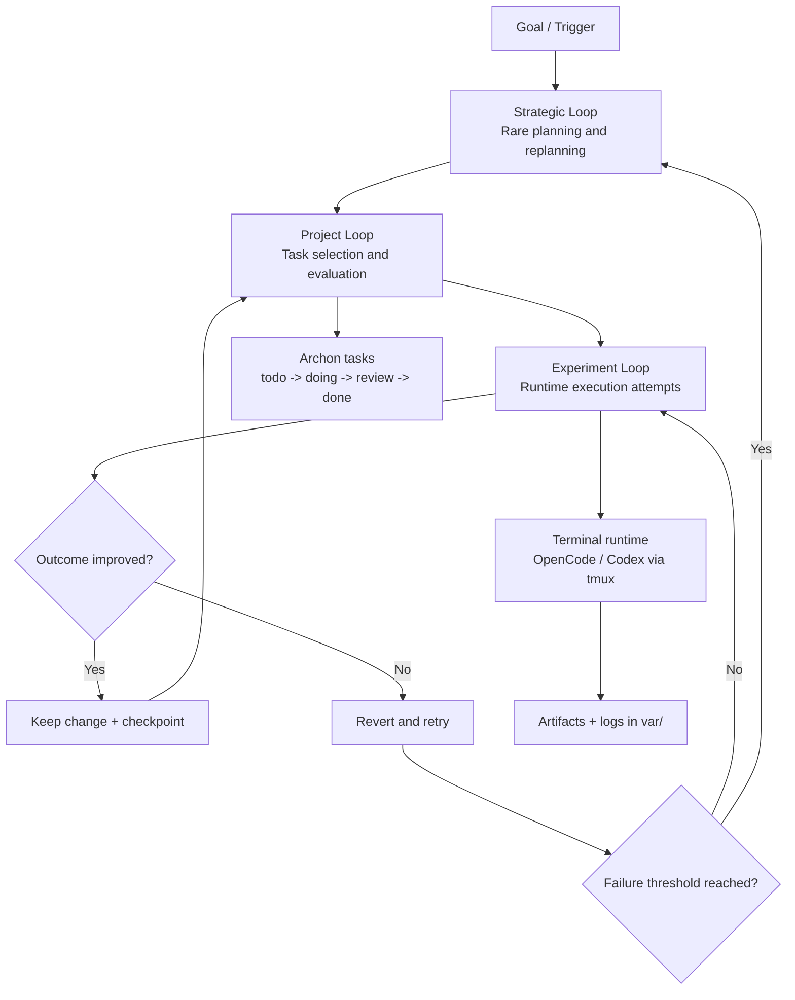
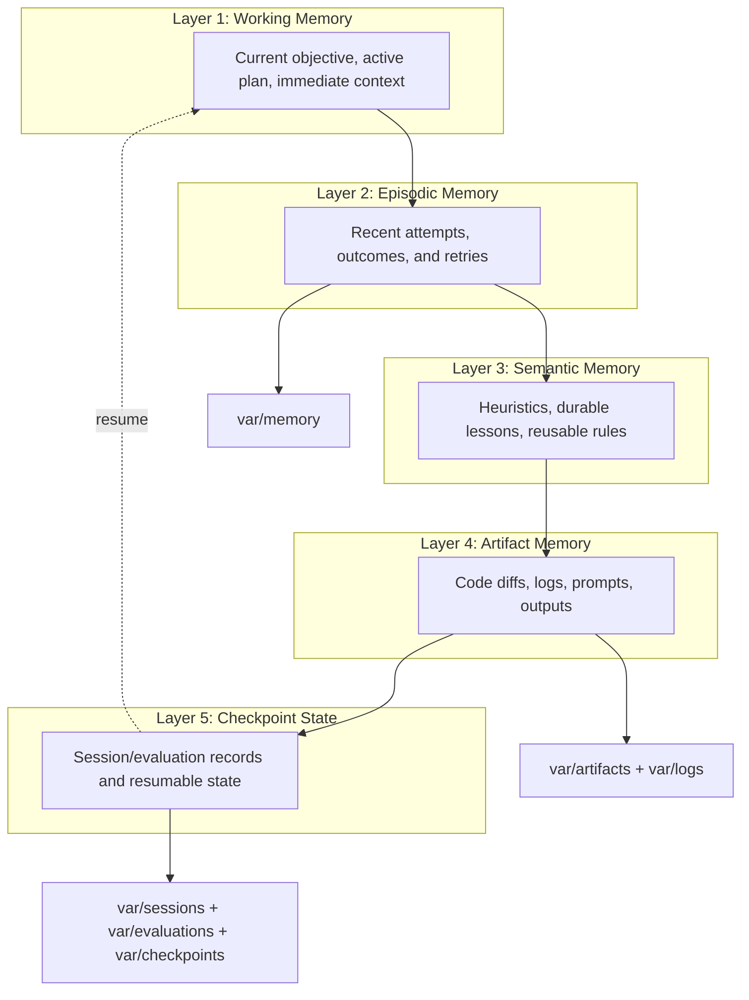

# Philosophy of Continuous Improvement

> "We're building tools that build tools that build tools that build real things."

## Origin

This philosophy descends from Karpathy's [autoresearch](https://github.com/karpathy/autoresearch) — a proof-of-concept where an AI agent autonomously optimizes a neural network training script overnight. The agent edits code, trains for a fixed 5-minute budget, evaluates against an immutable metric (`val_bpb`), and keeps or discards the change. Repeat forever.

Our system generalizes that pattern beyond ML training to any domain where an agent can try, measure, and learn.

## Core Principles

### 1. One-Shot or Discard

An agent gets one shot at a task. If it fails, you don't debug the broken run — you throw it away, adjust the prompt with what you learned from the failure, and start fresh with clean context.

Patching a broken context compounds errors. Fresh starts with better prompts converge faster.

This mirrors autoresearch exactly: if `val_bpb` didn't improve, `git reset`. No negotiation.

### 2. The Metric is Oracle Truth

Every loop needs an immutable success signal that no agent can game:

| Domain | Metric | Immutable? |
|--------|--------|-----------|
| ML training | `val_bpb` on fixed eval set | Yes — eval harness is read-only |
| Code | Tests pass, reviewer accepts | Yes — tests are the contract |
| User preferences | "Love it" vs "Don't like this" | Yes — the human is the oracle |
| Sales voice agent | Stayed on line vs hung up | Yes — reality is the oracle |
| n8n workflows | Correct node selected | Yes — optimal node exists objectively |
| Simulink digital twins | Used purpose-built block vs PDE soup | Yes — the catalog is ground truth |

If you can't define the metric, you can't run the loop.

### 3. Learn From Every Failure

When an agent fails, the failure is not waste — it's signal. But only if you capture it.

**Autoresearch captures learning in `results.tsv`** — every experiment logged with commit hash, metric, and description, regardless of outcome. The agent reads its own history to inform future experiments.

**Our system captures learning as prompt mutations.** When a run fails and the supervisor retries with an adjusted prompt, the delta between the old prompt and the new one *is* the learning. That delta must flow back to the research lane.

### 4. Two Feedback Loops, Always Running

```
┌─────────────────────────────────────────────────────────┐
│                                                         │
│   LAB LOOP (Research Lane)         FIELD LOOP           │
│   Synthetic tasks, controlled      Real applications,   │
│   experiments, prompt R&D          production work      │
│                                                         │
│   ┌──────────────┐                ┌──────────────┐      │
│   │ Refine       │───best────────►│ Agents build │      │
│   │ prompts &    │   prompts      │ with best    │      │
│   │ instructions │                │ instructions │      │
│   │              │◄──ground───────│              │      │
│   │              │   truth        │ Failures +   │      │
│   │              │   failures     │ prompt       │      │
│   │              │                │ mutations    │      │
│   └──────────────┘                └──────────────┘      │
│                                                         │
│   Theoretical learnings            Real-world learnings │
│   Cheap to run                     Expensive but true   │
│                                                         │
│   Neither loop ever stops.                              │
└─────────────────────────────────────────────────────────┘
```

The lab gets you a good starting point. The field tells you what actually breaks. You need both, always.

### 5. Domain-Agnostic Infrastructure

The loop architecture is the same everywhere:

1. **A prompt/script/approach** — the thing being optimized
2. **A supervisor** — spawns the attempt, monitors it, kills it if stuck
3. **An outcome signal** — did it work?
4. **A learning capture** — what to change next time
5. **A retry mechanism** — fresh context, mutated prompt

Code is first because the signal is cheapest to measure (tests pass or don't). But the architecture applies to preference learning, sales optimization, business automation, digital twins — anything with a measurable outcome.

### 6. Agents Use Components, Not Improvisation

The most common agent failure mode: **improvising from scratch when purpose-built components exist.**

- n8n agent invents custom Python nodes instead of using optimized built-in nodes
- Simulink agent strings together PDE blocks instead of using catalog models designed to mock specific off-the-shelf hardware (e.g., a NEMA stepper motor block)
- Code agent writes raw HTTP requests when there's an SDK

The fix: evaluators check component selection, capture what the right component was, and feed that back. Over time, agents build **component awareness** through the loop.

This is analogous to autoresearch's simplicity criterion: *"0.001 BPB improvement + 20 lines of hacky code = discard. 0.001 BPB improvement from deleting code = definitely keep."*

## System Architecture

### Nested Loops

The system operates as three nested loops with bounded escalation. When the inner loop fails enough times, it escalates to the outer loop — not to a human.

*Source: [01/research/architecture/nested-loops.md](/Users/mike/projects/01/research/architecture/nested-loops.md)*



- **Experiment Loop** — the inner loop. One-shot attempts. Keep or discard. Runs fast, runs often.
- **Project Loop** — picks tasks, evaluates outcomes, decides what to attempt next.
- **Strategic Loop** — rare. Triggered when the experiment loop exhausts its failure budget. Replans the approach.

This is autoresearch's keep/discard loop, but with escalation tiers instead of just "try something more radical."

### Memory Layers

Learnings need to persist across loops, sessions, and agent lifetimes. Five layers, each with different durability and access patterns.

*Source: [01/research/architecture/memory-layers.md](/Users/mike/projects/01/research/architecture/memory-layers.md)*



- **Working Memory** — what the agent is doing right now. Volatile. Lost on context reset (by design — one-shot).
- **Episodic Memory** — what happened recently. "I tried X, it failed because Y." Feeds prompt mutation.
- **Semantic Memory** — durable lessons. "Always use the NEMA motor block, not PDE soup." Survives across sessions.
- **Artifact Memory** — the receipts. Code diffs, logs, raw outputs. For post-hoc analysis and the lab loop.
- **Checkpoint State** — resumable state for long-running workflows. The dotted line back to Working Memory is the resume path.

The key insight: the lab loop reads from Layers 3-4 (semantic learnings + artifacts) to refine prompts. The field loop writes to Layers 2-4 (episodes + learnings + artifacts). The cycle never stops.

### Escalation Hierarchy

```
                    ┌──────────────┐
                    │   Oracle     │  O1 / deep reasoning model
                    │              │  Consulted rarely, with
                    │              │  precisely framed questions
                    └──────┬───────┘
                           │
              ┌────────────┴────────────┐
              │                         │
      ┌───────┴───────┐        ┌───────┴───────┐
      │  Human (Mike) │        │  Dante KARR   │  Strategic decisions,
      │               │        │  (Claude)     │  architecture, review
      └───────┬───────┘        └───────┬───────┘
              │                        │
              └────────────┬───────────┘
                           │
                   ┌───────┴───────┐
                   │ Orchestrator  │  What needs doing, who does it,
                   │               │  was it accepted?
                   └───────┬───────┘
                           │
                   ┌───────┴───────┐
                   │  Supervisor   │  Spawns agents, monitors runs,
                   │  (new layer)  │  kills stuck agents, adjusts
                   │               │  prompts, retries fresh
                   └───────┬───────┘
                           │
              ┌────────────┼────────────┐
              │            │            │
      ┌───────┴──┐  ┌─────┴────┐ ┌────┴───────┐
      │  Codex   │  │ OpenCode │ │  Other     │  Implementation
      │  (fork)  │  │  (fork)  │ │  agents    │  agents
      └──────────┘  └──────────┘ └────────────┘
                           │
                   ┌───────┴───────┐
                   │  Reviewer     │  ACP Codex lane / Shizzle
                   │               │  Accept → done
                   │               │  Reject → back to supervisor
                   └───────────────┘
```

### The Oracle Problem

The Oracle (O1 / deep reasoning model) is the most powerful and most expensive resource. You consult it rarely, and only with precisely framed questions.

**"You have to know the correct question to ask the Oracle. Otherwise, you get the answer after a thousand years is 42."**

The entire system below the Oracle exists to:
1. Try things autonomously without bothering the Oracle
2. Learn from failures without bothering the Oracle
3. Escalate only when the question is refined enough to get a useful answer

Bad escalation: "It's not working, what should I do?"
Good escalation: "We've tried approaches A, B, C with these specific results. The failure pattern suggests X. Should we pursue Y or Z?"

### Mapping to Autoresearch

| Autoresearch | Our System |
|-------------|------------|
| `train.py` | The task/prompt given to an agent |
| `program.md` | Research lane prompt engineering |
| `results.tsv` | Learning capture (prompt mutations, failure logs) |
| `val_bpb` | Domain-specific success metric |
| Agent edit → train → eval | Supervisor: spawn → monitor → collect |
| Keep/discard (git reset) | One-shot: accept or discard + retry |
| Human updates `program.md` | Lab loop refines prompts from field data |
| Fixed eval harness | Immutable reviewer/test criteria |
| Runs forever autonomously | Both loops never stop |

### What Autoresearch Doesn't Have (That We Need)

1. **Multi-agent coordination** — autoresearch is one agent, one file, one GPU. We have multiple agents across multiple domains.
2. **Supervisor layer** — autoresearch's agent is its own supervisor. We need a separate supervisor because our agents are less constrained and more likely to get stuck.
3. **Cross-domain learning** — autoresearch optimizes one thing. We need learnings from code tasks to inform non-code tasks and vice versa.
4. **Escalation** — autoresearch has no Oracle. When the agent is truly stuck, it just tries more radical changes. We have a reasoning hierarchy.
5. **Component awareness** — autoresearch's design space is intentionally tiny (one file). Our agents operate in vast design spaces where knowing what's available is half the battle.

## The Vision

Start with code because the feedback signal is cheapest. Build the infrastructure — supervisors, learning capture, prompt evolution, escalation hierarchy. Prove it works on synthetic tasks (snake game). Apply it to real applications. Capture field learnings back into the lab.

Then apply the same infrastructure to everything else: MCP server optimization, digital twins, voice agents, business automation, preference learning. The architecture doesn't change. The metric changes. The prompt changes. The loop is the same.

We're not building an AI coding tool. We're building a **general-purpose autonomous optimization engine** that happens to start with code.

> *"Imagine 100 agents running in parallel on 100 GPUs, each discovering locally-optimal models, sharing successful patterns."* — Karpathy's vision for autoresearch
>
> Now imagine that, but for everything.
